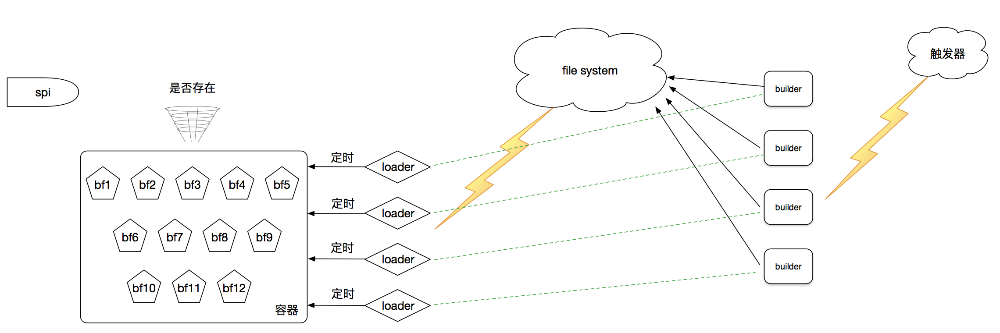
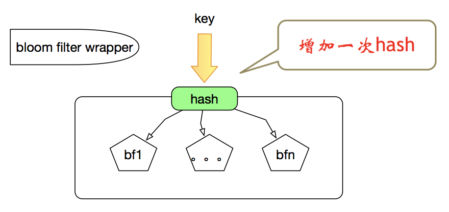

# bloomfilter-center
目前还比较凌乱，凑合着看，正在整理ing
布隆索引在实际工程中的使用：
a、判断某一个key是否在某个布隆索引里面
b、提供相应的容器管理机制、加载机制、构建机制、触发机制

## 架构示意图

## 概念

### BloomFilterService
定位:对外提供使用的方法：判断某个key是否在某个布隆索引里面。

### loader
定位：加载器：负责加载布隆索引

### builder
定位：构建器：负责构建布隆索引

### container
定位：容器:负责存储布隆索引

### controller
定位：控制者：负责加载相关配置，控制布隆索引加载、构建整个流程

### cleaner
定位：清理者：负责清理本地保存的临时布隆索引文件

### trigger
定位：触发器：负责触发布隆索引构建或者加载

### 领域模型介绍

由于时间关系，第一个版本的领域模型有点复杂，后续会重新设计。期望能够做到：大道至简，简单、明了，接受大家的检验

预计会引入：任务链概念：task_chains

#### BloomFilterWrapper
名字：暂定这个，后续考虑修改成其他 
定位： 
   (1)、负责分桶设计 
   (2)、能够灵活切换不同的布隆索引实现，通过配置文件切换实现：例如：guava里的实现、自定义的实现
   (3)、不仅仅单单指布隆索引的实现，还可以是：counting bloomfilter、compress bloomfilter、coko bloomfilter
   
   

## 时间安排

打算11月底，出第一个版本，关于布隆索引在实际当中的应用

